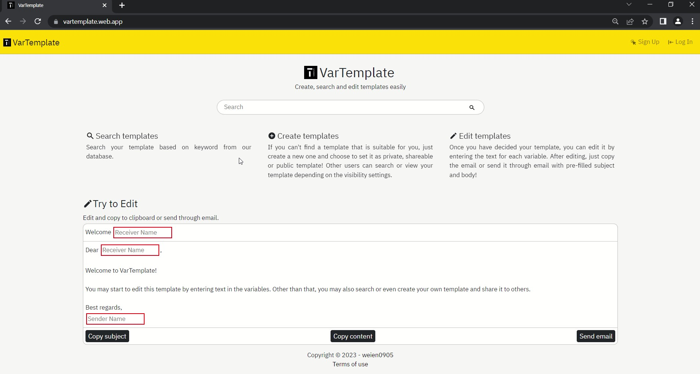

# VarTemplate

VarTemplate is a web application that utilised React in the front end, Django is the back end and natural language processing (NLP) for its search engine.

# Live Demo

It is deployed on [https://vartemplate.web.app/](https://vartemplate.web.app/).

[](https://vartemplate.web.app/)

# Table of Contents
- [Function](#function)
- [Usage](#usage)
- [File Structure](#file-structure)
- [Design and Implementation](#design-and-implementation)
    - [Front End - React](#front-end)
    - [Back End - Django](#back-end)
    - [Natural language processing (NLP) - Word2vec & Okapi BM25](#nlp)

<div id ="function">
</div>

# Function

VarTemplate is a platform for users to search, create and edit reusable email templates easily.

- The user can just search their desired email template from datebase or create their own template in the web application.

- After that, user can edit the template based on variables and copy it or send it through email.

- User may also save template for future reference, rate template or share the link of the template so that other users can view it.

<div id ="usage">
</div>

# Usage

Python 3.9 or above is required for JSONField in [Django models](api/models.py), otherwise kindly refer to [documentation](https://code.djangoproject.com/wiki/JSON1Extension).

- Clone the respository.

- Open a new terminal for Django:

    - Install all required packages.
    ```
    pip install -r requirements.txt
    ```

    - Create a sqlite3 database.
    ```
    python manage.py migrate
    ```

    - Run the Django app.
    ```
    python manage.py runserver
    ```

- Open another terminal for React:

   - Change your working directory to [reactapp](reactapp).
    ```
    cd reactapp
    ```

    - Install all dependencies.
    ```
    npm install
    ```

    - Run the React app.
    ```
    npm start
    ```

    - Go to [http://localhost:3000](http://localhost:3000) to view the web appplication.

<div id ="file-strcture">
</div>

# File Structure

File/Folder | Explanation
--- | ---
[api](api) | contains all the files for back end - Django
[reactapp](reactapp) | contains all the files for front end - React
[nlp](nlp) | contains all the files on showing how Word2vec and IDF data is pre-trained using NLP techniques in Jupyter Notebook format
[words.json](words.json) | contains the result of pre-trained data in JSON format

<div id ="design-and-implementation">
</div>

# Design and Implementation

<div id ="front-end">
</div>

## Front End - React

React is used in front end to provide better user experience.

- [Google Fonts](https://fonts.google.com/) is used for text font.

- [Bootstrap](https://getbootstrap.com/) is used to make HTML elements to have a nicer look.

- [React Icons](https://react-icons.github.io/react-icons/) is used for icons.

- [React Router](https://reactrouter.com/en/main) is used for page routing.

- [jwt-decode](https://www.npmjs.com/package/jwt-decode) is used to decode JSON Web Token.

### Routes

Route | Explanation
--- | ---
/ | Home page for users to search templates
/login | Log in page
/signup | Sign up page
/terms | Show terms of use
/saved-templates | Show saved templates of the user
/your-templates | Show templates posted by the user
/create | Enable user to create new template
/search-results | Show search results based on keyword
/template/:id | Show editable template and template details with the provided id
/error | Error page
\* | Show "Page does not exist" for all other routes

<div id ="back-end">
</div>

## Back End - Django

- [Django Rest Framework](https://www.django-rest-framework.org/) is used to communicate with front end.

- [JSON Web Token](https://django-rest-framework-simplejwt.readthedocs.io/en/latest/) is used for authentication.

- [UUID](https://docs.djangoproject.com/en/4.1/ref/models/fields/#uuidfield) is used for template primary key for security reasons.

- [nltk](https://www.nltk.org/) is used for implementing NLP techniques in back end.

### Models

- User
- Template

### Routes

Route | Explanation
--- | ---
/admin | Admin page
/api/token | Obtain JSON Web Token
/api/token/refresh |Refresh JSON Web Token
/api/signup | Ensure username is not taken and enable user to sign in
/api/login | Ensure username and password are valid and enable user to log in
/api/your-templates | Get user posted templates
/api/saved-templates | Get user saved templates
/api/search-results | Get search results based on keyword in search parameter using Word2vec & Okapi BM25
/api/delete/str:template_id | Ensure the user is owner and delete template
/api/save/str:template_id | Save template
/api/unsave/str:template_id | Unsave template
/api/change-visibility/str:template_id | Change visibility of template (Public/ Shareable/ Private)

<div id ="nlp">
</div>

## Natural language processing (NLP) - Word2vec & Okapi BM25

Natural language processing (NLP) techniques is used for search engine to provide more relevant search results.

The whole implemention of NLP can be found in [nlp](nlp).

### [Word2vec](https://en.wikipedia.org/wiki/Word2vec)

- Word2vec uses vectors to present each word. We can use vectors to find the distance of two words to know the similarity of two words. 

- Data from [CS50 AI](https://cdn.cs50.net/ai/2020/spring/lectures/6/src6/vectors/words.txt) is used after compared with a few [Gensim](https://radimrehurek.com/gensim/) models (credit goes to them). After that, Gensim is used in [word2vec.ipynb](nlp/word2vec.ipynb) to find the neighbours of a word with a similarity threshold and maximum number of neighbour. Run [word2vec.ipynb](nlp/word2vec.ipynb) to get the results in JSON file.

### [Okapi BM25](https://en.wikipedia.org/wiki/Okapi_BM25)

- Okapi BM25 is an improved version of the traditional ranking algorithm of TF-IDF. It considers document length and the score will not increase linearly with the term frequency. 

- Data of Enron Email Dataset from [Kaggle](https://www.kaggle.com/datasets/wcukierski/enron-email-dataset) is used for training the IDF values, which can be viewed in [bm25.ipynb](nlp/bm25.ipynb). Run [bm25.ipynb](nlp/bm25.ipynb) to get the results in JSON file.

### Implementation in web application

- The output from [word2vec.ipynb](nlp/word2vec.ipynb) for Word2vec and [bm25.ipynb](nlp/bm25.ipynb) for Okapi BM25 is combined in [words.ipynb](nlp/words.ipynb). The output of [words.ipynb](nlp/words.ipynb) will be used in the web application.

- In the web application, once the user enters his query, the query will be tokenized and we will get the neighbours of each word (excluding stopwords) and filter out all the templates with the word and its neighbours. After that, the templates that has been filtered out will go through the ranking process based on BM25 algorithm to identify the relevance of the templates.
